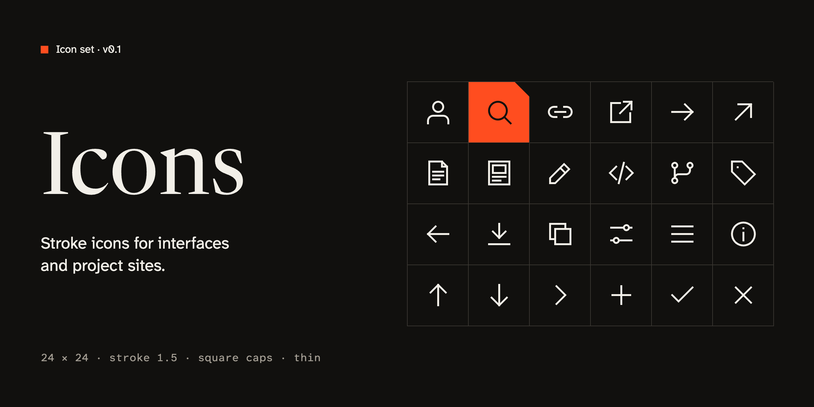

# yev-icons



My personal icons. Rejilla de 24, trazo de 1.5, extremos cuadrados y `currentColor`, así que toman el color del texto que los rodea.

Catálogo visual: `npm run preview` (o abre `dist/preview.html`).

## Estructura

```
icons/          FUENTE: los SVG que dibujo a mano (nombres en inglés, kebab-case)
scripts/        build.mjs + plantilla del catálogo
dist/           GENERADO con `npm run build`, no se edita a mano
  svg/          SVG optimizados, uno por icono
  sprite.svg    todos como <symbol id="nombre">
  icons.json    atributos comunes + markup interior de cada icono
  react/        componentes React (<CloseIcon />) + tipos
  preview.html  catálogo
```

`dist/` se versiona a propósito: los proyectos instalan el paquete directamente desde GitHub y jsDelivr sirve los archivos desde el repo.

## Uso

### Next.js / React

```sh
npm i github:enshetinin/yev-icons#v1.0.0
```

```tsx
import { CloseIcon, SearchIcon } from 'yev-icons';

<CloseIcon />                         // decorativo: aria-hidden
<SearchIcon size={16} />              // tamaño
<CloseIcon title="Cerrar" />          // con nombre accesible (role="img")
<CloseIcon className="text-red-600" /> // color vía CSS (currentColor)
```

- Funcionan en Server Components: no usan hooks ni `"use client"`.
- Aceptan cualquier prop de `<svg>` (`className`, `style`, `strokeWidth`, `ref`…).
- Si el icono acompaña a un texto visible, déjalo decorativo. Si va solo dentro de un botón, pon `aria-label` en el botón.

Para actualizar un proyecto a una versión nueva, cambia el tag: `npm i github:enshetinin/yev-icons#v1.1.0`.

### HTML sin build

```html

```

`` no hereda `currentColor` (sale negro). Para que tome el color del texto, pega el SVG inline o usa el sprite servido desde tu propio dominio:

```html
<svg width="24" height="24" aria-hidden="true"><use href="/sprite.svg#close"/></svg>
```

### Figma / Illustrator

Arrastra los archivos de `dist/svg/`. Son trazos, no formas rellenas, así que puedes cambiar el grosor allí mismo.

## Añadir o cambiar un icono

1. Dibuja siguiendo [GUIDELINES.md](GUIDELINES.md) y exporta el SVG a `icons/<nombre>.svg`.
2. `npm run build`. Si el icono no cumple las reglas, el build falla y dice por qué.
3. Revisa el resultado en `npm run preview`.
4. Sube la versión en `package.json` (minor para iconos nuevos, major si renombras o borras), commit y tag:

   ```sh
   git tag v1.1.0 && git push && git push --tags
   ```
